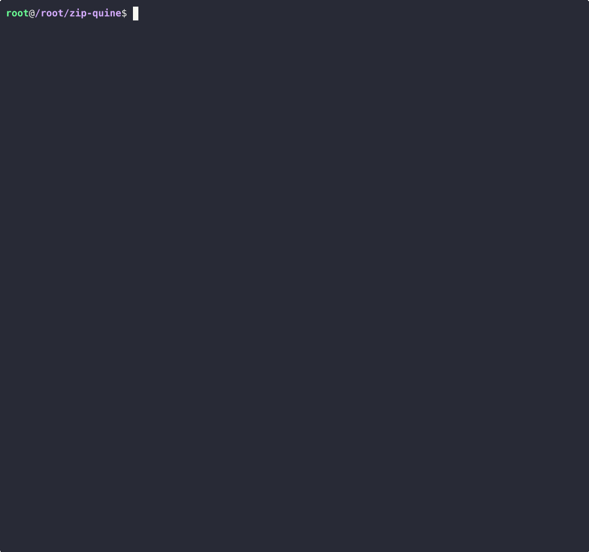

# Zip quine

This is a program that generates a ZIP file with a program that generates a ZIP file...

[main.c](./main.c) was generated by running [gen.c](./gen.c) (`gcc gen.c && ./a.out > main.c`).

It would be easier to understand gen.c however is relies very heavily on macros and might be hard to read.

I didn't really encode the crc32 so prgrams could complain about that.

